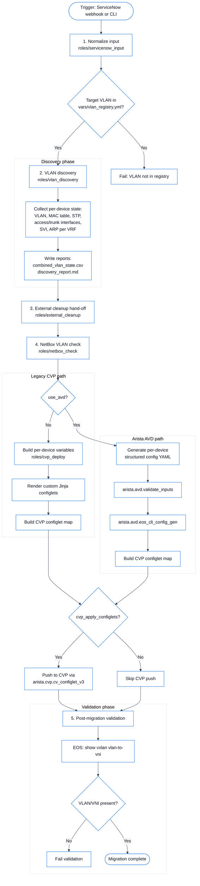

# Operating Guide — cvg-vxlan

## Design goals

- **AAP-first** but runnable from Ansible CLI/AWX.
- **Primary platforms**: Arista EOS and Cisco NXOS. Cisco IOS/IOS-XE is also supported.
- **Single source of truth** for VLAN intent: `vars/vlan_registry.yml`.
- **Safe defaults**: destructive decommission requires an explicit flag.
- **VXLAN migration target**: Arista EOS configlets deployed via CloudVision (CVP).
  Multi-vendor discovery and decommission support remains for EOS, NXOS, and IOS.
- **Data center scoping**: inventory groups `dc_lisle` and `dc_omaha`.

## Data model

Edit `vars/vlan_registry.yml` once per VLAN:

| Field | Required | Notes |
|-------|----------|-------|
| `id` | yes | 802.1Q VLAN ID |
| `name` | yes | Human-readable label |
| `action` | yes | `migrate` or `decommission` |
| `vni` | for migrate | VXLAN Network Identifier |
| `vlan_name` | no | Desired VLAN name after migration |
| `mcast_group` | no | Per-VLAN BUM group; falls back to `vxlan_default_mcast_group` |
| `explicit_trunk_interfaces` | no | For decommission, prune only these trunks |

## CLI usage

### 1. Install collections

```bash
ansible-galaxy collection install -r collections/requirements.yml -p collections/
```

### 2. Provide credentials

Do **not** use shell environment variables. Credentials and integration endpoints
should be supplied via an Ansible Vault file, a scoped variable file, or
Ansible Automation Platform (AAP) credentials.

Create an encrypted vault file, for example `inventory/group_vars/vault.yml`:

```bash
ansible-vault create inventory/group_vars/vault.yml
```

Example contents:

```yaml
---
vault_ansible_user: admin
vault_ansible_password: changeme
netbox_url: https://netbox.example.com
netbox_token: "<netbox-api-token>"
cvp_url: https://cvp.example.com
cvp_token: "<cvp-api-token>"
```

In AAP:

- Attach a **Machine** or **Network** credential to the Job Template for
  `ansible_user` / `ansible_password`.
- Create custom credential types for NetBox (`netbox_url`, `netbox_token`) and
  CVP (`cvp_url`, `cvp_token`) and attach them to the relevant Job Templates.

### 3. Discover current state (per data center)

```bash
# Discover all VLANs in the registry
ansible-playbook -i inventory/hosts.yml playbooks/discover_vlan_state.yml --limit dc_lisle

# Discover a single VLAN
ansible-playbook -i inventory/hosts.yml playbooks/discover_vlan_state.yml \
  --limit dc_lisle -e target_vlan_ids='[100]'
```

Reports land in `reports/`:

- `<hostname>_vlan_state.json` — raw command output per host
- `combined_vlan_state.csv` — summary across the data center
- `discovery_report.md` — human-readable report with MAC, STP, SVI, ARP, and cleanup-ready flags

### ServiceNow-driven end-to-end workflow

The `workflow_vlan_to_vxlan.yml` playbook runs the complete migration from a
ServiceNow change ticket.  For local testing, pass manual overrides:

```bash
# Ensure credentials are provided via inventory/group_vars/vault.yml or AAP credentials first.
ansible-playbook -i inventory/hosts.yml playbooks/workflow_vlan_to_vxlan.yml \
  --limit dc_lisle \
  -e manual_vlan_id=100 \
  -e manual_data_center=lisle \
  -e manual_target_vrf=default \
  -e cvp_apply_configlets=false

# Same workflow using Arista AVD for EOS configlet generation
ansible-playbook -i inventory/hosts.yml playbooks/workflow_vlan_to_vxlan.yml \
  --limit dc_lisle \
  -e manual_vlan_id=100 \
  -e manual_data_center=lisle \
  -e manual_target_vrf=default \
  -e use_avd=true \
  -e cvp_apply_configlets=false
```

### Detailed workflow



Steps performed:

1. Normalize ServiceNow / manual input.
2. Discover VLAN state (VLAN, MAC, STP, interfaces, SVI, ARP) per switch.
3. Mark discovered VLAN as `pending` for external cleanup.
4. Verify VLAN exists in NetBox.
5. Generate (and optionally push) CVP configlets for Arista leaf/border-leaf switches.
6. Validate post-migration state.

### 4. Dry-run decommission plan

```bash
ansible-playbook -i inventory/hosts.yml playbooks/dry_run_decommission.yml \
  --limit dc_lisle -e target_vlan_ids='[900,910]'
```

This writes `reports/dry_run_decommission.csv` listing, per switch, the SVIs,
trunk interfaces, and VLANs that would be removed. No changes are made.

### 5. AVD-based CVP configlet generation

For large, continuous Arista-only migrations, generate CVP configlets with
Arista AVD (`arista.avd.eos_cli_config_gen`) instead of the legacy Jinja
templates:

```bash
# Generate configlets only
ansible-playbook -i inventory/hosts.yml playbooks/deploy_to_cvp_avd.yml \
  --limit dc_lisle \
  -e target_vlan_id=100 \
  -e target_data_center=lisle \
  -e target_vrf=default \
  -e cvp_apply_configlets=false

CVP configlet push creates a **pending** change control (`cvp_change_control_state: set` by
default). It is **not** approved or executed automatically; an operator must approve and run it
in CloudVision. To override, pass `-e cvp_change_control_state=approve_and_execute -e
cvp_change_control_auto_execute_allowed=true` explicitly.

# Generate and push to CVP
# Ensure cvp_url and cvp_token are supplied via vault/AAP credentials first.
ansible-playbook -i inventory/hosts.yml playbooks/deploy_to_cvp_avd.yml \
  --limit dc_lisle \
  -e target_vlan_id=100 \
  -e target_data_center=lisle \
  -e target_vrf=default \
  -e cvp_apply_configlets=true
```

Set per-device BGP parameters as hostvars (`bgp_as`, `router_id`) or as
`avd_default_bgp_as` in group variables.

To use AVD inside the full workflow, set:

```bash
-e use_avd=true
```

### 6. Run migration stream only

```bash
# Scope to a data center
ansible-playbook -i inventory/hosts.yml playbooks/migrate_vlans_to_vxlan.yml --limit dc_lisle

# Scope to specific VLANs
ansible-playbook -i inventory/hosts.yml playbooks/migrate_vlans_to_vxlan.yml \
  --limit dc_lisle -e target_vlan_ids='[100,200]'
```

### 6. Run decommission stream only

```bash
# Review first (dry-run report)
ansible-playbook -i inventory/hosts.yml playbooks/dry_run_decommission.yml \
  --limit dc_lisle -e target_vlan_ids='[900,910]'

# Execute after review
ansible-playbook -i inventory/hosts.yml playbooks/decommission_vlans.yml \
  --limit dc_lisle -e vlan_change_dangerous=true -e target_vlan_ids='[900,910]'
```

## AAP usage

1. **Execution Environment**: build `execution-environment/execution-environment.yml`
   and push to your AAP registry.
2. **Project**: point AAP at this Git repository.
3. **Inventories**: import `inventory/hosts.yml` or configure a dynamic inventory.
4. **Credentials**: create Machine/Network credentials and link them to Job Templates.
5. **Job Templates**:
   - `playbooks/workflow_vlan_to_vxlan.yml` (end-to-end ServiceNow-driven migration)
   - `playbooks/discover_vlan_state.yml`
   - `playbooks/check_netbox.yml`
   - `playbooks/deploy_to_cvp.yml` (legacy Jinja configlets)
   - `playbooks/deploy_to_cvp_avd.yml` (Arista AVD configlets)
   - `playbooks/dry_run_decommission.yml`
   - `playbooks/migrate_vlans_to_vxlan.yml`
   - `playbooks/decommission_vlans.yml`
   - `playbooks/validate_network_state.yml`
6. **Surveys** (optional): expose `target_vlan_ids` and `target_actions` as survey
   questions so operators can scope a Job run without editing files.  For the
   full workflow, expose `manual_vlan_id`, `manual_data_center`, and `manual_target_vrf`
   for ad-hoc runs or map them from the ServiceNow webhook payload.
7. **Workflows** (example):
   - ServiceNow webhook triggers `workflow_vlan_to_vxlan` with change ticket data.
   - Discovery, cleanup hand-off, NetBox check, CVP deployment, and validation run
     as a single orchestrated workflow.
   - Discovery: `discover_vlan_state`
   - Decommission planning: `dry_run_decommission`
   - Approval node
   - Decommission: `decommission_vlans` (with `vlan_change_dangerous=true`)
   - Migration: `migrate_vlans_to_vxlan`
   - Validation: `validate_network_state`

## Safety controls

- `--check` and `--diff` are supported end-to-end.
- `vlan_change_dangerous` must be `true` for decommission to make changes.
- A pre-change backup is saved per host under `backups/<hostname>/`.
- Migration and decommission playbooks are separate; `site.yml` filters by
  `target_actions` so a VLAN cannot be migrated and deleted in the same run
  unless explicitly requested.

## Extending to other platforms

Discovery and decommission support EOS, NXOS, and IOS. The VXLAN migration
configlet generation targets **Arista EOS via CVP**. To add another platform:

1. Add `network_os_family: <new>` in `inventory/group_vars/<new>.yml`.
2. Add platform-specific task files in `roles/vlan_discovery/tasks/`
   and `roles/decommission_vlan/tasks/`.
3. For EOS VXLAN migration configlets, extend `roles/migrate_to_vxlan/`,
   `roles/cvp_deploy/`, or `roles/avd_vxlan_config/` as appropriate.

## Validation

Use the standalone validation playbook after any change:

```bash
ansible-playbook -i inventory/hosts.yml playbooks/validate_network_state.yml
```
