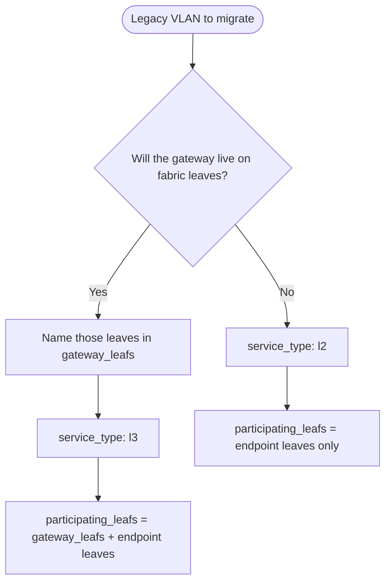

# VXLAN service types (L2 vs L3)

How to choose `service_type` (`l2` or `l3`) when migrating a legacy VLAN to VXLAN/EVPN on Arista EOS.

This field is required on every VLAN record under `vars/vlans/<dc>/`. It says where the **gateway** will live after migration. It does not describe how many leaves learn endpoints.

`l2_l3` is deprecated. Endpoint VLAN presence on additional leaves is normal EVPN placement (`participating_leafs`), not a separate stretch type.

---

## Summary

| `service_type` | Gateway after migration | What the fabric does |
|---|---|---|
| `l2` | Stays **outside** the VXLAN fabric | Layer-2 transport only |
| `l3` | Hosted **inside** the VXLAN fabric, on `gateway_leafs` | L2 VNI plus the gateway (centralized or distributed) |

`gateway_leafs` are named by the engineer. Discovery never copies a legacy SVI into that list. A discovered SVI is a **source gateway** (today's MLS or aggPE). That device is the root of the legacy L2, so it is prune-eligible unless it also has local endpoints or the engineer named it in `gateway_leafs`.

A border-leaf pair plus the leaves that host endpoints is a normal L3 migration. Example: gateway on `cma01-blf01` and `cma01-blf02`, endpoints on `fntc-aggacc-sw05` and `fntc-aggacc-sw06`. The type is `l3`. Participating leaves are the border leaves plus the two endpoint switches. Gateway leaves are the border leaves only.

---

## L2 (`service_type: l2`)

The gateway remains outside the fabric (firewall, router, or another device you are not moving into VXLAN). The fabric extends the broadcast domain.

- `participating_leafs` are the VTEPs that need the L2 VNI because they attach local endpoints.
- `gateway_leafs` stays empty.
- Do not create an L3 VNI for this VLAN.

---

## L3 (`service_type: l3`)

The gateway moves into the fabric. It may be centralized on a border-leaf pair or distributed across leaves. Placement is `gateway_leafs`, and those leaves are also participating leaves.

```yaml
service_type: l3
gateway_leafs:
  - cma01-blf01
  - cma01-blf02
```

Set `vrf` to the target VRF. Assign `evpn.l2.vni` before deploy. Leave `evpn.l3` empty. The VRF and its L3 VNI are already on the fabric, so deploy does not create them (`cvp_build_borderleaf_config` defaults to `false`). BUM is head-end replication, already on the VTEPs. Do not set `mcast_group`.

---

## Where the VLAN must exist

| List | Meaning |
|---|---|
| `participating_leafs` | Deploy the VNI here. Gateway leaves, plus any switch with local endpoint attachment. |
| `gateway_leafs` | Subset of participating leaves that will host the gateway. Explicit only. |
| `prune_eligible_leafs` | VLAN exists today and there are no local endpoints. Source gateways are included and listed first. |
| `source_gateway_devices` | Current SVI owners. The same host is also prune-eligible when it has no local endpoints. |

A switch is participating only when endpoint-facing interfaces are found locally (server, mainframe OSA, storage, hypervisor, or appliance ports; or MAC/ARP tied to those ports), or when it is listed in `gateway_leafs`.

These do **not** qualify:

- MAC addresses learned only on an uplink
- The VLAN allowed on a trunk
- The VLAN present in the VLAN database
- Transit aggregation
- Fabric interconnects

---

## Discovery outputs

| File | Use |
|---|---|
| `*_discovery_*.md` | Short operator report |
| `*_discovery_*.yml` | Deployable model. Paste into `vars/vlans/<dc>/` after assigning VNIs and gateway leaves |
| `*_discovery_*.json` | Analysis payload for an LLM (model, evidence, raw discovery facts) |

The YAML model is what you deploy. The JSON file is not a config source.

### Routes that belong to the VLAN

Discovery keeps a static or a BGP object only when it is tied to this VLAN's prefix:

| Object | Included when |
|---|---|
| Static route | The next hop is an address inside the VLAN prefix (a firewall in the subnet), the static prefix is the VLAN prefix, or an optional `static_route_tags` entry equals the route `name` (case-insensitive) |
| BGP `network` / `aggregate-address` | The statement advertises the VLAN prefix, a more-specific, or an aggregate that covers it |
| BGP `redistribute connected` or `static` | The device owns the SVI, so the prefix may be advertised. The VRF may be shared; confirm it |
| BGP neighbor | The peer address is inside the VLAN prefix, or `update-source` is the VLAN SVI |

Fabric default routes and spine iBGP are left out unless a tag equals that route's name. Tags are optional and the engineer enters them on the VLAN record (`static_route_tags`). These objects are written under `routing.associated` for review and so the gateway move can recreate them. Prune does not delete them.

---

## Decision flow



---

## Related documentation

- [WORKFLOWS.md](WORKFLOWS.md) - VLAN DB schema and Core workflow
- [vars/vlans/README.md](../vars/vlans/README.md) - per-DC file layout
- [examples/discover-vlan.md](examples/discover-vlan.md) - discovery commands and report fields
