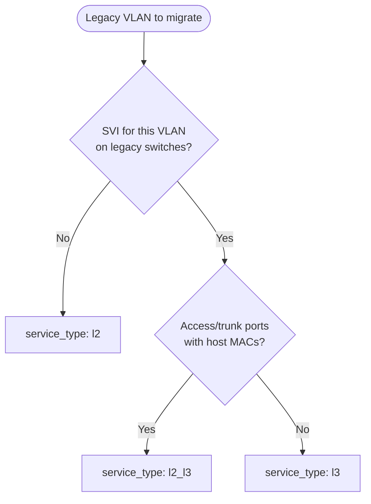

# VXLAN service types (L2 vs L3)

How to choose `service_type` (`l2`, `l3`, or `l2_l3`) when migrating a legacy VLAN to VXLAN/EVPN on Arista EOS.

This field is required in every VLAN record under `vars/vlans/<dc>/`. It documents migration intent, drives discovery scope, and helps operators plan cutover work.

---

## Summary

| `service_type` | What you are migrating | SVI on fabric? | Typical legacy signals |
|---|---|---|---|
| `l2` | A **broadcast domain** (subnet stretched as L2) | No (gateway elsewhere) | VLAN + ports + MACs; no SVI on leaf |
| `l3` | A **routed network** (subnet + gateway on fabric) | Yes | SVI (`interface VlanX`), ARP on SVI, VRF |
| `l2_l3` | Both L2 extension **and** local L3 gateway | Yes | Ports/MACs **and** SVI/ARP |

---

## L2 (`service_type: l2`)

**Goal:** Carry VLAN **X** as VNI **Y** so hosts stay in the same L2 segment across the VXLAN fabric.

- MAC addresses are learned and advertised via EVPN (Type-2).
- Hosts typically keep the same IP subnet; the **default gateway is not** on the migrating leaf SVI (it may live on a firewall, router, or another device).
- Config focus: `vlan X`, `interface Vxlan1`, `vxlan vlan X vni Y`, multicast/BUM as designed.

**Choose L2 when discovery shows:**

- VLAN present on access/trunk ports
- Learned MACs on the segment
- **No** SVI for that VLAN on the switches you are migrating

**Cutover note:** L2 migration moves *where the segment lives*, not necessarily *where routing happens*. Confirm gateway and IP planning with the network design team before CVP push.

---

## L3 (`service_type: l3`)

**Goal:** Migrate a **routed VLAN** into a VRF on the VXLAN fabric: L2 VNI **plus** L3 gateway behavior on the leaf (or border).

- Same VNI mapping as L2 for the broadcast domain.
- An **SVI** (`interface VlanX`) in a **VRF** provides the subnet gateway.
- EVPN carries host routes and, where enabled, IP prefix/VRF routes (Type-2 / Type-5 depending on design).
- Border leaves may need VRF/VNI import when the VRF is not `default`.

**Choose L3 when discovery shows:**

- SVI present (`show run interface Vlan<id>`)
- ARP entries on that SVI (active L3 use)
- VRF binding on the SVI

**Example:** VLAN 810 (`iner_dmz`) with SVI and ARP on agg/border devices is an **L3** migration.

**Cutover note:** Coordinate VRF name, VNI, RD/RT, and any border-leaf import with the fabric design. Set `vrf` in the VLAN DB to the **target** VRF on the VXLAN side.

---

## L2 + L3 (`service_type: l2_l3`)

**Goal:** The VLAN has **both** stretched L2 attachment (servers, trunks, MAC learning) **and** an SVI that acts as (or participates in) the gateway for that subnet.

Use when discovery reports:

- Non-empty **Ports** / MAC learning **and**
- SVI + ARP on the same VLAN

This is common for “server VLAN with gateway on the leaf pair” designs. Planning and config scope combine L2 VNI work with L3 VRF/SVI work.

---

## How this repo uses `service_type`

### VLAN database

Every migrate record must set `service_type` to one of: `l2`, `l3`, `l2_l3` (see `roles/vlan_db/defaults/main.yml`).

```yaml
# vars/vlans/lisle/0810_iner_dmz.yml
id: 810
name: iner_dmz
action: migrate
service_type: l3    # l2 | l3 | l2_l3
vni: 10024
vrf: default
target_switches:
  - chi01-blf01
  - chi01-blf02
```

### Discovery

Discovery is **read-only**. `service_type` documents migration intent. SVI and ARP are collected whenever an SVI exists (including if SSOT still says `l2`). BGP, statics, and VRF context are collected on L3-capable devices and scoped to the SVI VRF in the report — even when that VRF is shared.

| Check | Runs for |
|---|---|
| `show vlan id` / ports / trunks | All types |
| MAC table | All types |
| `show run interface Vlan<id>` (SVI) | Whenever collected (always queried; parsed if present) |
| ARP in SVI VRF | When an SVI exists |
| BGP / statics / VRF RD-RT | When `discovery_collect_prune_context=true` (default); shown if an SVI is present |

Probe mode (`discovery_allow_probe=true`) defaults new records to `l3`; override with `-e discovery_probe_service_type=l2` when you know the VLAN is L2-only.

### Deploy (configlets)

Generated configlets (Jinja or AVD) today focus on:

- VLAN + VNI mapping on `Vxlan1`
- Multicast group (or fabric default)
- Optional EVPN BGP VLAN section when `evpn_enabled=true`
- Optional border-leaf VRF/VNI import when `avd_build_borderleaf_config` / `cvp_build_borderleaf_config` is enabled and `vrf` is not `default`

`service_type` does **not** switch playbooks; it documents intent and aligns discovery with what you expect on the network. If you migrate an L3 VLAN, ensure discovery confirmed SVI/VRF and that `vrf` / `vni` match the target design before CVP push.

---

## Decision flow



---

## Related documentation

- [WORKFLOWS.md](WORKFLOWS.md) - VLAN DB schema and Core workflow
- [vars/vlans/README.md](../vars/vlans/README.md) - per-DC file layout
- [examples/discover-vlan.md](examples/discover-vlan.md) - discovery commands and report fields
- [examples/generate-config-without-cvp-push.md](examples/generate-config-without-cvp-push.md) - review configlets before CVP

---

## Out of scope (this repo)

- Greenfield VXLAN VLAN creation (separate tooling)
- Automatic SVI creation or full EVPN policy design (configlets are migration snippets; fabric baseline is assumed)
- Trunk prune / legacy cleanup (reported in discovery for a human; apply is parked)
