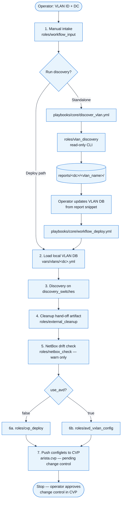
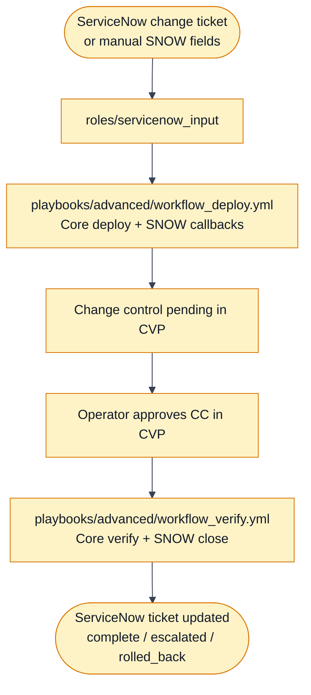

# Workflows — Core vs Advanced

This repository automates **legacy VLAN → VXLAN/EVPN migration** on Arista EOS via CloudVision (CVP).
Discovery spans EOS, NXOS, and IOS; config generation and CVP push target **Arista EOS only**.

Two workflow tiers share the same roles. **Build and harden Core first**, then enable Advanced when ServiceNow integration is ready.

---

## Scope

| In scope (this repo) | Out of scope |
|---|---|
| Read-only VLAN discovery and reporting | Greenfield / new VLAN deployments (separate app) |
| Local per-DC VLAN DB as primary SSOT | Automatic trunk/SVI cleanup on devices |
| AVD or Jinja → CVP configlet generation | NetBox export as part of the migration run |
| CVP change control creation (pending approval) | Executing CVP change control automatically |

Legacy VLAN cleanup and trunk pruning are **reported** during discovery and handed off to **`decomm-vlan`** - not applied here.

---

## Core workflow

**Input:** VLAN ID + data center (+ VLAN record in local SSOT for deploy).

**Output:** Discovery reports; CVP configlets in a **pending** change control.

**End state:** Operator approves and executes the change control in CloudVision. The Ansible run stops there.



### Core playbooks

| Playbook | Purpose |
|---|---|
| `playbooks/core/discover_vlan.yml` | Read-only discovery; writes VLAN-centric reports |
| `playbooks/core/workflow_deploy.yml` | Intake → discovery → CVP configlet push (ends at pending CC) |
| `playbooks/core/workflow_verify.yml` | Optional post-approval verification (separate run) |
| `playbooks/core/workflow.yml` | Deploy + verify chained (demo/lab only) |

### Primary SSOT

Per-DC local VLAN databases (one YAML file per VLAN):

- `vars/vlans/lisle/0100_legacy_web.yml`
- `vars/vlans/omaha/0100_legacy_web.yml`

See `vars/vlans/README.md` and `vars/vlans/<dc>/_example.yml` for naming rules.

NetBox is **secondary**. A missing NetBox record logs a warning; the run continues unless `netbox_ssot_required: true`.

### Standalone utilities (not in workflow)

| Playbook | Purpose |
|---|---|
| `playbooks/export_vlan_to_netbox.yml` | Export local VLAN DB attributes to NetBox (dry-run by default) |
| `playbooks/check_netbox.yml` | One-off NetBox VLAN lookup |

---

## Advanced workflow

Wraps Core with ServiceNow at **start** (intake) and **end** (status callbacks).



| Playbook | Purpose |
|---|---|
| `playbooks/advanced/workflow_deploy.yml` | Core deploy + SNOW “pending approval” callback |
| `playbooks/advanced/workflow_verify.yml` | Core verify + SNOW “complete” / escalation |
| `playbooks/advanced/workflow.yml` | Chained deploy + verify (no CVP wait) |

---

## Discovery — what it collects

Per switch, per VLAN (read-only):

| Attribute | Source |
|---|---|
| VLAN + L2 ports | `show vlan id <id>` (Ports column; empty = no access/trunk) |
| Access vs trunk | Ports from `show vlan id` vs `show interfaces trunk` names |
| Learned MACs | `show mac address-table dynamic vlan <id>` |
| SVI / L3 | `show run interface Vlan<id>` |
| SVI VRF + ARP | VRF from SVI config; `show ip arp vrf <vrf> …` |

**Port logic:** Empty **Ports** on `show vlan id` means no L2 attachment. Remaining ports are access/endpoints unless they appear in `show interfaces trunk`, in which case they are trunk prune candidates — except EOS MLAG peer (`switchport trunk group mlagpeer`) and NXOS vPC peer-link trunks, which are excluded from maintenance lists.

Reports land under:

```text
reports/<dc>/<vlan_slug>/<vlan_slug>_discovery_<timestamp>.{md,csv,json,yml}
```

---

## VLAN database schema (per record)

| Field | Required | Notes |
|---|---|---|
| `id` | yes | 802.1Q VLAN ID |
| `name` | yes | Human label; used in report filenames |
| `action` | yes | `migrate` |
| `service_type` | yes | `l2`, `l3`, or `l2_l3` |
| `vni` | yes for migrate | VXLAN network identifier |
| `vrf` | yes | Target VRF |
| `target_switches` | yes | Inventory hostnames for CVP config push |
| `discovery_switches` | no | Switches to query; defaults to `target_switches` |
| `vlan_name` | no | Post-migration VLAN name |
| `mcast_group` | no | BUM group override |

---

## Typical operator journey (Core)

1. **Discover** an unknown VLAN → review report → copy snippet to `vars/vlans/<dc>/{vid}_{slug}.yml`.
2. **Complete the VLAN record** (VNI, VRF, `target_switches`, `service_type`).
3. **Deploy** configlets to CVP (`cvp_apply_configlets=true`).
4. **Approve and execute** the change control in CloudVision.
5. *(Optional)* **Verify** with `workflow_verify.yml` after the change is live.
6. *(Optional)* **Export to NetBox** with `export_vlan_to_netbox.yml` when inventory should reflect the migrated VLAN.

Detailed flags and examples: **[USAGE_GUIDE.md](USAGE_GUIDE.md)**.
