# VLAN → VXLAN Migration Workflow (v2)

This document describes the **target-state** end-to-end workflow for migrating a legacy
VLAN to VXLAN/EVPN, driven by a ServiceNow change ticket and orchestrated with
Event-Driven Ansible (EDA). It supersedes the ad-hoc brainstormed diagram and is meant
to be the reference for closing the gap between "what's drawn" and "what's implemented"
in `playbooks/workflow_vlan_to_vxlan.yml`.

Integrations in scope:

- **ServiceNow** — change ticket intake and status callbacks.
- **Event-Driven Ansible (EDA)** — webhook listener, approval-wait event source, and
  workflow resumption (replaces synchronous polling/failing on "not yet approved").
- **NetBox** — primary source of truth (SSOT) for VLAN/VRF/site metadata.
- **Local VLAN registry** (`vars/vlan_registry.yml`) — secondary/pluggable SSOT, used
  when NetBox is unreachable or when NetBox integration/data sync is still catching up.
  Not preferred, but functionally equivalent for the fields this workflow needs.
- **Arista CloudVision (CVP) + AVD** — schema-validated EOS config generation and
  Change-Control-gated deployment.
- **Native device connections** — `arista.eos` and `cisco.nxos` for read-only discovery
  of legacy VLAN/SVI/trunk/MAC/ARP state (no config changes made during discovery).

## Design principles carried over from v1 review

1. A **failed SSOT lookup terminates the run** (fail-closed) — both the NetBox path and
   the local-registry fallback path report `not found / conflict` back to ServiceNow and
   end the workflow rather than silently continuing. This is intentional, not a gap.
2. The **local registry is a backup, not a peer**, to NetBox. It is only consulted when
   NetBox is unreachable or has not yet synced the record. It is not used to override
   NetBox when NetBox is available and consistent.
3. **Rollback always re-runs the full post-change verification checklist.** A rollback is
   not considered successful until the same checks used to validate the forward change
   pass against the restored state.
4. **CVP Change Control approval is an event, not a poll-until-fail.** EDA listens for
   the CVP approval event (or a scheduled recheck) and resumes the workflow, instead of
   the playbook hard-failing when the change control isn't approved yet.

## Step-by-step

### Phase 0 — Intake (ServiceNow → EDA)

1. A change requester creates a **VLAN → VXLAN migration** ticket in ServiceNow
   (Customer ID, Location/DC, VLAN, Old VRF, New VRF).
2. ServiceNow triggers a **webhook** on ticket approval/creation.
3. The **EDA rulebook** receives the webhook event and matches it to the
   `vlan_to_vxlan_migration` rule.
4. EDA parses the payload and validates required fields are present:
   `customer_id`, `location` (`dc_lisle` / `dc_omaha`), `vlan_id`, `old_vrf`, `new_vrf`.
   - **Invalid/incomplete** → EDA posts a validation error back to ServiceNow and the
     run ends. No playbook is launched.
   - **Valid** → EDA launches `playbooks/workflow_vlan_to_vxlan.yml` (or triggers an
     AAP Job Template) with the normalized extra vars.

### Phase 1 — SSOT resolution (NetBox primary, local registry fallback)

5. `roles/netbox_check` queries NetBox for the VLAN/VRF/site record.
6. **NetBox reachable and data consistent?**
   - **Yes** → proceed to Phase 2 using the NetBox record.
   - **No** (NetBox unreachable, timeout, or integration lag) → fall back to
     `vars/vlan_registry.yml` (local registry).
7. **Local registry data OK?**
   - **Yes** → proceed to Phase 2 using the local registry record, flagged
     `ssot_source: local_registry` in the report for traceability.
   - **No** → return `conflict/not-found` details to ServiceNow. **End.**

### Phase 2 — Legacy state discovery (native EOS/NXOS connections)

8. Connect natively to the target device(s) via `arista.eos` (EOS) or `cisco.nxos`
   (NXOS) — read-only, no config changes.
9. Collect legacy VLAN state: VLAN present, SVI presence/status, trunk/access
   interfaces carrying the VLAN, MAC address table entries, ARP table for the old VRF.
10. Generate the migration readiness report (`combined_vlan_state_<ts>.csv`,
    `discovery_report_<ts>.md`) under `reports/<scope>/` (see
    `docs/OPERATING_GUIDE.md` for the DC/device scoping rules).
11. Hand off the discovered VLAN to the external cleanup tool
    (`roles/external_cleanup`) — marks it `pending_cleanup`; still no device changes.

### Phase 3 — Config generation and CVP deployment

12. Generate target EOS configuration using **Arista AVD**
    (`roles/avd_vxlan_config` → `arista.avd.eos_cli_config_gen`), or the legacy Jinja
    path (`roles/cvp_deploy`) if `use_avd=false`.
13. Push the generated configlets to CVP via the `arista.cvp` collection.
14. Create a CVP **Change Control** in `set` (pending) state — never
    auto-execute unless `cvp_change_control_auto_execute_allowed=true` is explicitly set.
15. **CVP Change Control approval granted?**
    - **No** → EDA registers an **event source** watching CVP for the change-control
      approval event (or polls on an interval) and holds the ticket in
      `wait_for_approval` state in ServiceNow. When approval is detected, EDA resumes
      the workflow at Phase 4. No playbook process is left running/blocked.
    - **Yes** → proceed to Phase 4.

### Phase 4 — Execute and verify

16. Execute the change via CVP Change Control.
17. Run the **post-change verification checklist**:
    - EVPN BGP session/peer status established.
    - VTEP reachability (underlay between VTEPs).
    - VXLAN VNI status (VNI up / mapped correctly).
    - VLAN ↔ VXLAN VNI mapping present on target devices.
    - MAC/ARP learning observed for the migrated VLAN.
18. **Verification successful?**
    - **Yes** → update ServiceNow (`migration complete`). **End.**
    - **No** → **Rollback needed?**
      - **Yes** → roll back via CVP Change Control, then **re-run the full
        post-change verification checklist from step 17** against the restored state
        (not just a rollback-specific subset).
        - Verification of the rollback passes → update ServiceNow
          (`migration rolled back`). **End.**
        - Verification of the rollback fails → escalate to manual troubleshooting.
      - **No** → escalate to manual troubleshooting.
19. Escalation updates ServiceNow with diagnostic detail and assigns to a human. **End.**

## Mermaid diagram

```mermaid
flowchart LR
    Start([Start]) --> SNOWCreate[ServiceNow: create<br/>VLAN→VXLAN migration ticket]
    SNOWCreate --> Webhook[ServiceNow triggers webhook]
    Webhook --> EDA[EDA rulebook receives event]
    EDA --> ParseInput[Parse & normalize inputs:<br/>customer_id, location,<br/>vlan_id, old_vrf, new_vrf]
    ParseInput --> InputValid{Inputs complete<br/>& valid?}
    InputValid -- No --> ReturnValErr[Return validation error<br/>to ServiceNow]
    ReturnValErr --> End1([End])
    InputValid -- Yes --> QueryNetbox[Query NetBox SSOT for<br/>VLAN/VRF/site details]
    QueryNetbox --> NetboxOK{NetBox reachable &<br/>data consistent?}
    NetboxOK -- Yes --> Discover[Collect legacy device state<br/>via native EOS/NXOS connections]
    NetboxOK -- No --> LocalRegistry[Fallback: query local<br/>VLAN registry]
    LocalRegistry --> LocalOK{Local registry<br/>data OK?}
    LocalOK -- Yes --> Discover
    LocalOK -- No --> ReturnConflict[Return conflict/not-found<br/>details to ServiceNow]
    ReturnConflict --> End2([End])

    Discover --> GenReport[Generate migration readiness report<br/>CSV + Markdown]
    GenReport --> Cleanup[Hand off to external<br/>cleanup tool]
    Cleanup --> GenConfig[Generate target configs<br/>using Arista AVD]
    GenConfig --> PushCVP[Push configlets to CVP<br/>via arista.cvp collection]
    PushCVP --> CCApproved{CVP Change Control<br/>approval granted?}
    CCApproved -- No --> EDAWait[EDA watches for CVP approval event<br/>ServiceNow ticket: wait_for_approval]
    EDAWait -.resume on approval.-> CCApproved
    CCApproved -- Yes --> ExecuteCC[Execute change via<br/>CVP Change Control]
    ExecuteCC --> Verify[Post-change verification:<br/>EVPN BGP peers, VTEP reachability,<br/>VNI status, VLAN↔VXLAN mapping,<br/>MAC/ARP learning]
    Verify --> VerifyOK{Verification<br/>successful?}
    VerifyOK -- Yes --> UpdateSNOWDone[Update ServiceNow:<br/>migration complete]
    UpdateSNOWDone --> End3([End])
    VerifyOK -- No --> RollbackNeeded{Rollback<br/>needed?}
    RollbackNeeded -- Yes --> Rollback[Rollback via<br/>CVP Change Control]
    Rollback --> Verify
    RollbackNeeded -- No --> Escalate[Escalate / manual<br/>troubleshooting]
    Escalate --> UpdateSNOWEsc[Update ServiceNow:<br/>escalated]
    UpdateSNOWEsc --> End4([End])
```

## Implementation status vs. this spec

| Phase | Step | Status |
|-------|------|--------|
| 0 | ServiceNow webhook → EDA rulebook | **Not implemented** — currently manual/extra-var invocation only |
| 0 | Input validation | Implemented (`roles/servicenow_input`) |
| 1 | NetBox lookup | Implemented (`roles/netbox_check`) |
| 1 | Local registry fallback on NetBox failure | Implemented (`roles/netbox_check`) — falls back to `vars/vlan_registry.yml` only when NetBox itself is unreachable; a reachable NetBox's "not found" still fails closed |
| 2 | Native EOS/NXOS discovery | Implemented (`roles/vlan_discovery`, `gather_eos.yml` / `gather_nxos.yml`) |
| 2 | Readiness report (CSV/MD) | Implemented, now with DC/device-scoped timestamped paths |
| 2 | External cleanup hand-off | Implemented (`roles/external_cleanup`) |
| 3 | AVD config generation | Implemented (`roles/avd_vxlan_config`) |
| 3 | CVP push + Change Control (pending state) | Implemented, with explicit-approval enforcement |
| 3 | EDA-driven approval wait/resume | **Not implemented** — currently the play just fails if not approved |
| 4 | Execute change | Implemented |
| 4 | Post-change verification (full checklist) | **Partially implemented** — only VLAN/VNI mapping check exists today |
| 4 | Rollback via CVP Change Control | **Not implemented** |
| 4 | Re-verify after rollback | **Not implemented** |
| 4 | ServiceNow status callbacks | **Not implemented** |

This table is the punch list for turning v2 into working automation. Suggested build
order: (1) NetBox fallback, (2) full verification checklist, (3) ServiceNow callbacks,
(4) rollback + re-verify, (5) EDA rulebook + approval-wait event source last, since it
depends on all the synchronous playbook logic being correct first.
